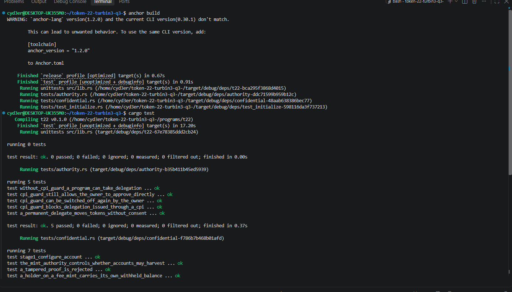
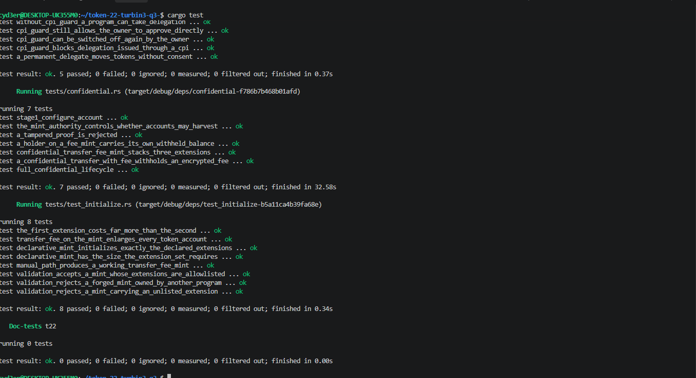

# Token-2022 Remittance Stablecoin

An Anchor program for issuing a Token-2022 remittance stablecoin with issuer-controlled fees, KYC account freezing, on-chain metadata pointers, mint closure, permanent delegation, and confidential transfers.

The program ID is:

```text
6sC5C8VFoTpEZQVn3YK9EUSd5g3Cs6zTT3HCDBGQkyo4
```

## What This Project Provides

The issuer can create and manage mints with:

- A protocol-level transfer fee using `TransferFeeConfig`.
- A `MetadataPointer` that points to the mint itself.
- `DefaultAccountState::Frozen`, so new token accounts require KYC before use.
- `MintCloseAuthority`, allowing the mint to be closed after decommissioning.
- Epoch-aware fee calculation with `calculate_epoch_fee`.
- Individual account thawing after KYC approval.
- A `PermanentDelegate` for regulated seizure workflows.
- Confidential transfers with manual account approval.

All mint sizes are calculated with `ExtensionType::try_calculate_account_len`.

## Prerequisites

Install the following tools:

- Rust 1.89.0 or later
- Solana CLI compatible with the workspace toolchain
- Anchor CLI
- Git

The workspace currently uses Anchor libraries version `1.2.0`. Use a matching Anchor CLI where possible. The local configuration uses a localnet provider and the default Solana wallet at `~/.config/solana/id.json`.

Confirm the tools are available:

```bash
rustc --version
solana --version
anchor --version
```

## Build the Program

From the repository root:

```bash
anchor build
```

The deployable program is written to:

```text
target/deploy/t22.so
```

## Run the Tests

Run the complete Rust test suite:

```bash
cargo test
```

Run only the Token-2022 program tests:

```bash
cargo test -p t22 --tests
```

Run an individual test suite:

```bash
cargo test -p t22 --test test_initialize
cargo test -p t22 --test authority
cargo test -p t22 --test confidential
```

The confidential tests use LiteSVM and load `target/deploy/t22.so`, so run `anchor build` before testing when the program artifact does not exist or has changed.

## Build and Test Results

Successful Anchor build and initial test execution:



Complete `cargo test` output showing the authority, confidential-transfer, and initialization suites passing:



## Program Structure

The main program is located at:

```text
programs/t22/src/lib.rs
```

The integration tests are located at:

```text
programs/t22/tests/
```

- `test_initialize.rs` checks mint sizing, extension initialization, transfer fees, and extension validation.
- `authority.rs` checks CPI guard and permanent-delegate behavior.
- `confidential.rs` checks confidential account configuration, proofs, deposits, pending balances, transfers, and withdrawals.

## Mint Creation

### Standard fee mint

Use `create_mint_with_fee` when the mint needs the standard issuer configuration. It initializes these extensions before `InitializeMint2`:

1. `MintCloseAuthority`
2. `MetadataPointer`
3. `DefaultAccountState::Frozen`
4. `TransferFeeConfig`

The payer is used as the mint authority, freeze authority, close authority, metadata pointer authority, transfer-fee authority, and withheld-fee authority in the example implementation.

The instruction accepts:

- `decimals`: token precision.
- `basis_points`: fee rate in basis points.
- `maximum_fee`: maximum fee charged per transfer.

New token accounts are frozen by default. The issuer must thaw an account after completing KYC.

### Confidential and seizure-enabled reissue

Confidential transfers cannot be added to an initialized mint. To support both confidential transfers and regulated seizure, create a new mint with `reissue_confidential_seizable_mint`.

The reissued mint includes:

- The original close authority.
- The metadata pointer.
- The frozen default account state.
- The transfer-fee configuration.
- `PermanentDelegate` for the seizure authority.
- `ConfidentialTransferMint` with manual approval.
- `ConfidentialTransferFeeConfig`.

`ConfidentialTransferFeeConfig` is required because Token-2022 rejects a mint that combines `TransferFeeConfig` and `ConfidentialTransferMint` without the confidential fee companion extension.

The reissue instruction requires the issuer to provide:

- Token decimals.
- Transfer-fee basis points.
- Maximum transfer fee.
- The ElGamal public key used by the confidential fee authority.

Reissuing creates a new mint address. Existing balances must be migrated under an issuer-controlled migration plan; the original mint cannot be retrofitted with confidential transfers.

## Transfer Fees

Use `transfer_with_fee`, not a normal transfer instruction, for public transfers from a fee-bearing mint.

The handler:

1. Reads the mint with `StateWithExtensions<MintState>`.
2. Loads the live `TransferFeeConfig` extension.
3. Calculates the fee for the current epoch with `calculate_epoch_fee(current_epoch, amount)`.
4. Executes `transfer_checked_with_fee`.

This avoids using a stale cached fee rate when the mint has an epoch-scheduled fee change.

## KYC and Frozen Accounts

`DefaultAccountState::Frozen` affects newly initialized token accounts. It does not replace the mint freeze authority and does not automatically thaw accounts.

The KYC flow is:

1. Create or initialize the token account.
2. Complete the issuer's off-chain KYC checks.
3. Call `thaw_after_kyc` with the mint freeze authority.
4. The account can now participate in normal transfers.

The thaw operation targets one token account and does not change the mint's default account state.

## Confidential Transfer Lifecycle

Confidential operations require client-side key derivation and zero-knowledge proof generation. The on-chain program forwards the proof-context accounts to Token-2022; it does not generate proofs or learn private balances.

The expected lifecycle is:

1. **Create the token account**
   Allocate enough space for `ConfidentialTransferAccount` and any account-side extensions required by the mint.

2. **Initialize the token account**
   Initialize it for the confidential-transfer mint. Creating an ATA and configuring confidential transfers are separate operations.

3. **Configure the account**
   Call `configure_confidential_account` as the token-account owner. Supply the encrypted zero balance, pending-balance limit, and a valid proof context.

4. **Deposit public tokens**
   Call `deposit_confidential`. The deposited amount moves into the account's pending confidential balance.

5. **Apply the pending balance**
   Call `apply_pending_balance` with the owner's updated decryptable balance and the expected credit counter.

6. **Transfer confidentially**
   Call `transfer_confidential` with the new source decryptable balance, encrypted auditor ciphertexts, and the required proof contexts.

7. **Withdraw confidential tokens**
   Call `withdraw_confidential` with the withdrawal proofs and the new decryptable balance.

8. **Apply before withdrawal when needed**
   Use `withdraw_confidential_after_apply` when pending credits must be applied immediately before withdrawal. This instruction applies the pending balance first and then performs the confidential withdrawal.

For manual approval mints, account configuration does not imply approval. The issuer must use the Token-2022 approval flow after reviewing the account and its proof data.

## Seizure Workflow

The `PermanentDelegate` extension allows the designated authority to move tokens from a holder account without the holder signing a transfer. This is a powerful compliance control and should be treated as an irreversible trust decision for users.

The seizure authority must:

1. Confirm the source account and mint are the intended accounts.
2. Confirm the sanction or legal basis for the action.
3. Sign as the mint's permanent delegate.
4. Use `permanent_delegate_seize` to transfer the sanctioned balance.

Permanent delegation does not reveal confidential balances. Confidential seizure requires a design that is compatible with the confidential-transfer extension and its proof requirements; public `transfer_checked`-style seizure is not a substitute for confidential balance proofs.

## Reading Token-2022 State

Mint and token-account extension data must be read through `StateWithExtensions`:

```rust
let state = StateWithExtensions::<MintState>::unpack(&data)?;
let fee_config = state.get_extension::<TransferFeeConfig>()?;
```

Do not use a base-state-only unpack when extension data controls behavior. Extension state contains authorities, fee schedules, metadata pointers, confidential-transfer configuration, and account-side confidential balances.

## Local Development Notes

The local program configuration is in `Anchor.toml`:

- Cluster: `localnet`
- Program: `t22`
- Local validator: skipped by the current configuration
- Wallet: `~/.config/solana/id.json`

To run a local validator manually, use a separate terminal and then run the tests that require it. LiteSVM-based tests do not require a long-running validator.

## Security Considerations

- Transfer fees change the amount received. Downstream accounting must use the actual fee-aware transfer semantics.
- Fee schedules are epoch-dependent. Always calculate the fee for the current epoch.
- Frozen default accounts require a secure and auditable KYC thaw authority.
- Permanent delegation gives the authority the ability to seize holder funds.
- Confidential keys are wallet-controlled. Losing the key material can make confidential balances unreadable or unusable.
- Proof context accounts and all Token-2022 accounts should be validated by the Token-2022 program and checked for the expected mint relationship.
- Mint reissuance creates a new asset. Supply migration, redemption, and user communication are application responsibilities.